# Bellabeat Case Study (Fitness Tracker)


Table of Contents: 
[Introduction](#case-study-introduction)
[Ask](#ask)
[Prepare](#prepare)
[Process](#process)
[Analyze](#analyze)
[Share & Act](#share--act-key-marketing-points)

#### David Chilin

#### 8/13/2021

## Introduction

Welcome to my first case study as part of the **Google Data Analytics Certification program**.

This case study is a requirement for the certification and I'm treating it as a real-world project, as if I were a junior data analyst at Bellabeat.


* * *

## Case Study Introduction

_Bellabeat_, a high-tech manufacturer of health-focused products for women, is looking for market growth opportunities.

The **goal** for this case study is to develop marketing insights based on analysis of non-Bellabeat user fitness tracking data. Main Tasks:

* Analyze consumer product use, and advise how our products can meet user needs (functions used).
* Analyze usage trends, and advice how our marketing/products can match with users (categorieze users).
* Personal side goal, practice using R for analysis and visualizations.

Current Bellabeat products include:

* **Leaf** - Classic wellness tracker worn as a bracelet, necklace, or clip. Tracks - Activity, sleep, and stress.
* **Time** - Wristwatch style wellness tracker. Tracks - Activity, sleep, and stress.
* **Spring** - Water bottle that tracks water intake.
* **Bellabeat membership** - Subscription to 24/7 fully personalized guidance on nutrition, activity, sleep, health and beauty, and mindfulness.
* **Bellabeat App** - Interface for Bellabeat smart wellness products with health data related to user activity, sleep, stress, menstrual cycle, hydration, and mindfulness habits.

Case study approach will follow Google Data Analysis Process (using R): **Ask**, **Prepare**, **Process**, **Analyze**, **Share**, and **Act**.

* * *

## Ask

1.  Business Task: Present insights from non-Bellabeat smart device usage analytics to guide marketing strategy for growth.
    
2.  Key Stakeholders: Co-founders Urška Sršen and Sando Mur, Bellabeat marketing analytics team.
    
3.  Report Deliverables:
    
    * Clear summary of business task
    * Description of all data sources used
    * Documentation of cleaning/manipulation process
    * Summary of analysis
    * Supporting visualization and key findings
    * Top level recommendations based on analysis

* * *

## Prepare

1.  Data Source: [FitBit Fitness Tracker Data LINK](https://www.kaggle.com/arashnic/fitbit) (CC0: Public Domain, dataset made available through Mobius): This Kaggle data set contains personal fitness tracker data from thirty-three FitBit users. The eligible Fitbit users consented to the submission of personal tracker data, including second/minute/hour/day-level output for physical activity (distance, steps), heart rate, and sleep monitoring.
    
2.  Data Details:
    
    * Storage: Local copy from Kaggle repository (18 .csv files)
    * Limitations: 33 Users with second/minute/hourly/daily-level granularity, 31 Days, Dates: April.12.2016 to May.12.2016. Metrics recorded: heartrate, steps, distance, intensity, sleep
    * License: CC0 Public Domain
    * Verification/Integrity: Case study data from officially referenced link.
    * Usage: Contains consumer fitness tracking data which is premised to be useful for case study goals.
    * **Issues with Data**: Considering goals of case study are marketing focused and dataset contains no demographic data (age, sex, location, etc); this case study will focus on usage/non-usage of tracker features and user classification - activity/sleep/schedule. Assumption: Users submitted all FitBit data recorded, each Id represents a unique user, and data describes features usage.
3.  Deliverable: Data Description/Structure.
    
    First major step will be to review dataset files, set aside (_drop_) data that doesn’t seem relevant or helpful for goals, and present some initial ideas/observations (see: Notes on .csv files and columns)
    
```R
    # Setup environment and Load R library packages:
    knitr::opts_chunk$set(echo = TRUE)
    
    library(reshape2) # for melt()
    library(tidyverse)
    
    ## ── Attaching packages ─────────────────────────────────────── tidyverse 1.3.1 ──

    ## ✓ ggplot2 3.3.5     ✓ purrr   0.3.4
    ## ✓ tibble  3.1.3     ✓ dplyr   1.0.7
    ## ✓ tidyr   1.1.3     ✓ stringr 1.4.0
    ## ✓ readr   2.0.1     ✓ forcats 0.5.1

    ## ── Conflicts ────────────────────────────────────────── tidyverse_conflicts() ──
    ## x dplyr::filter() masks stats::filter()
    ## x dplyr::lag()    masks stats::lag()

    library(lubridate) # for mdy_hms()

    ## 
    ## Attaching package: 'lubridate'

    ## The following objects are masked from 'package:base':
    ## 
    ##     date, intersect, setdiff, union

    library(FactoMineR)
    library(factoextra)

    ## Welcome! Want to learn more? See two factoextra-related books at https://goo.gl/ve3WBa

    library(cluster)
    library(formattable) # nice table formatting
    library(patchwork) # create side-by-side plots

    ## 
    ## Attaching package: 'patchwork'

    ## The following object is masked from 'package:formattable':
    ## 
    ##     area

    library(here)

    ## here() starts at /home/user/Programs/Tutorial/Google_Data_Analytics_Certification/Case_Study/FitBit

    data_dir <- "Fitabase Data 4.12.16-5.12.16"
```
List .csv data files available:
```R
    # List .csv data files:
    list.files(path = here(data_dir))

    ##  [1] "dailyActivity_merged.csv"           "dailyCalories_merged.csv"          
    ##  [3] "dailyIntensities_merged.csv"        "dailySteps_merged.csv"             
    ##  [5] "heartrate_seconds_merged.csv"       "hourlyCalories_merged.csv"         
    ##  [7] "hourlyIntensities_merged.csv"       "hourlySteps_merged.csv"            
    ##  [9] "minuteCaloriesNarrow_merged.csv"    "minuteCaloriesWide_merged.csv"     
    ## [11] "minuteIntensitiesNarrow_merged.csv" "minuteIntensitiesWide_merged.csv"  
    ## [13] "minuteMETsNarrow_merged.csv"        "minuteSleep_merged.csv"            
    ## [15] "minuteStepsNarrow_merged.csv"       "minuteStepsWide_merged.csv"        
    ## [17] "sleepDay_merged.csv"                "weightLogInfo_merged.csv"
```
Considering goals, focus will be limited to hourly/daily data by skimming second/minute datasets:
```r
    minuteCaloriesNarrow_merged.csv, minuteCaloriesWide_merged.csv, minuteIntensitiesNarrow_merged.csv, minuteIntensitiesWide_merged.csv, minuteMETsNarrow_merged.csv, minuteSleep_merged.csv, minuteStepsNarrow_merged.csv, minuteStepsWide_merged.csv, heartrate_seconds_merged.csv
```
Now to load .csv files of interest and explore structure of files.
```r
    # Read in .csv files
    dailyActivity <- read.csv(here(data_dir,"dailyActivity_merged.csv"))
    dailyCalories <- read.csv(here(data_dir,"dailyCalories_merged.csv"))
    dailyIntensities <- read.csv(here(data_dir,"dailyIntensities_merged.csv"))
    dailySteps <- read.csv(here(data_dir,"dailySteps_merged.csv"))
    hourlyCalories <- read.csv(here(data_dir,"hourlyCalories_merged.csv"))
    hourlyIntensities <- read.csv(here(data_dir,"hourlyIntensities_merged.csv"))
    hourlySteps <- read.csv(here(data_dir,"hourlySteps_merged.csv"))
    sleepDay <- read.csv(here(data_dir,"sleepDay_merged.csv"))
    weightLogInfo <- read.csv(here(data_dir,"weightLogInfo_merged.csv"))
```
Preview top two rows for each .csv file.
```r
    # Preview .csv files
    head(dailyActivity, 2)

    ##           Id ActivityDate TotalSteps TotalDistance TrackerDistance
    ## 1 1503960366    4/12/2016      13162          8.50            8.50
    ## 2 1503960366    4/13/2016      10735          6.97            6.97
    ##   LoggedActivitiesDistance VeryActiveDistance ModeratelyActiveDistance
    ## 1                        0               1.88                     0.55
    ## 2                        0               1.57                     0.69
    ##   LightActiveDistance SedentaryActiveDistance VeryActiveMinutes
    ## 1                6.06                       0                25
    ## 2                4.71                       0                21
    ##   FairlyActiveMinutes LightlyActiveMinutes SedentaryMinutes Calories
    ## 1                  13                  328              728     1985
    ## 2                  19                  217              776     1797

    head(dailyCalories, 2)

    ##           Id ActivityDay Calories
    ## 1 1503960366   4/12/2016     1985
    ## 2 1503960366   4/13/2016     1797

    head(dailyIntensities, 2)

    ##           Id ActivityDay SedentaryMinutes LightlyActiveMinutes
    ## 1 1503960366   4/12/2016              728                  328
    ## 2 1503960366   4/13/2016              776                  217
    ##   FairlyActiveMinutes VeryActiveMinutes SedentaryActiveDistance
    ## 1                  13                25                       0
    ## 2                  19                21                       0
    ##   LightActiveDistance ModeratelyActiveDistance VeryActiveDistance
    ## 1                6.06                     0.55               1.88
    ## 2                4.71                     0.69               1.57

    head(dailySteps, 2)

    ##           Id ActivityDay StepTotal
    ## 1 1503960366   4/12/2016     13162
    ## 2 1503960366   4/13/2016     10735

    head(hourlyCalories, 2)

    ##           Id          ActivityHour Calories
    ## 1 1503960366 4/12/2016 12:00:00 AM       81
    ## 2 1503960366  4/12/2016 1:00:00 AM       61

    head(hourlyIntensities, 2)

    ##           Id          ActivityHour TotalIntensity AverageIntensity
    ## 1 1503960366 4/12/2016 12:00:00 AM             20         0.333333
    ## 2 1503960366  4/12/2016 1:00:00 AM              8         0.133333

    head(hourlySteps, 2)

    ##           Id          ActivityHour StepTotal
    ## 1 1503960366 4/12/2016 12:00:00 AM       373
    ## 2 1503960366  4/12/2016 1:00:00 AM       160

    head(sleepDay, 2)

    ##           Id              SleepDay TotalSleepRecords TotalMinutesAsleep
    ## 1 1503960366 4/12/2016 12:00:00 AM                 1                327
    ## 2 1503960366 4/13/2016 12:00:00 AM                 2                384
    ##   TotalTimeInBed
    ## 1            346
    ## 2            407

    head(weightLogInfo, 2)

    ##           Id                 Date WeightKg WeightPounds Fat   BMI
    ## 1 1503960366 5/2/2016 11:59:59 PM     52.6     115.9631  22 22.65
    ## 2 1503960366 5/3/2016 11:59:59 PM     52.6     115.9631  NA 22.65
    ##   IsManualReport        LogId
    ## 1           True 1.462234e+12
    ## 2           True 1.462320e+12
```
### Notes on .csv files and columns:

In general all .csv files have an “Id” column which will be used as a unique FitBit user identifier and used to manipulate and merge datasets.

* **dailyActivity**:
    
    * TotalDistance almost identical to TrackerDistance, _drop TrackerDistance_, LoggedActivitiesDistance not really used, _drop LoggedActivitiesDistance_
    * SedentaryActiveDistance values are mostly 0, _drop SedentaryActiveDistance_
    * Summarise Participants Activity in barchart/table of total distance/steps/minutes tracked by week/month, with color bar matching intensities.
    * Some observations have almost all 0 values, in particular 0 daily Calories, these will be dropped.
    * Line chart of each participants (cumulative?) steps/distance/calorie over the month, if notice pattern (i.e. weekly or Mondays), consider appropriate reminders, or one-day membership perk to keep on track.
* **dailyCalories, dailyIntensities, dailySteps**:
    
    * Redundant data from dailyActivity, _drop dailyCalories, dailyIntensities, dailySteps_
* **hourlyCalories**:
```r
        hourlyCalories %>%
          select(-Id) %>%
          summary()
    
        ##  ActivityHour          Calories     
        ##  Length:22099       Min.   : 42.00  
        ##  Class :character   1st Qu.: 63.00  
        ##  Mode  :character   Median : 83.00  
        ##                     Mean   : 97.39  
        ##                     3rd Qu.:108.00  
        ##                     Max.   :948.00
    
        h_values <- hist(
          hourlyCalories$Calories,
          breaks = c(0, 100, 200, 400, 1000),
          main = "Dataset's Hourly Calorie Counts",
          ylab = "Count",
          xlab = "Calories Burned / Hour",
          freq = TRUE
        )
        
        text(h_values$mids,
          h_values$counts,
          labels = h_values$counts,
          adj = c(0.5, 0.5)
        )
```
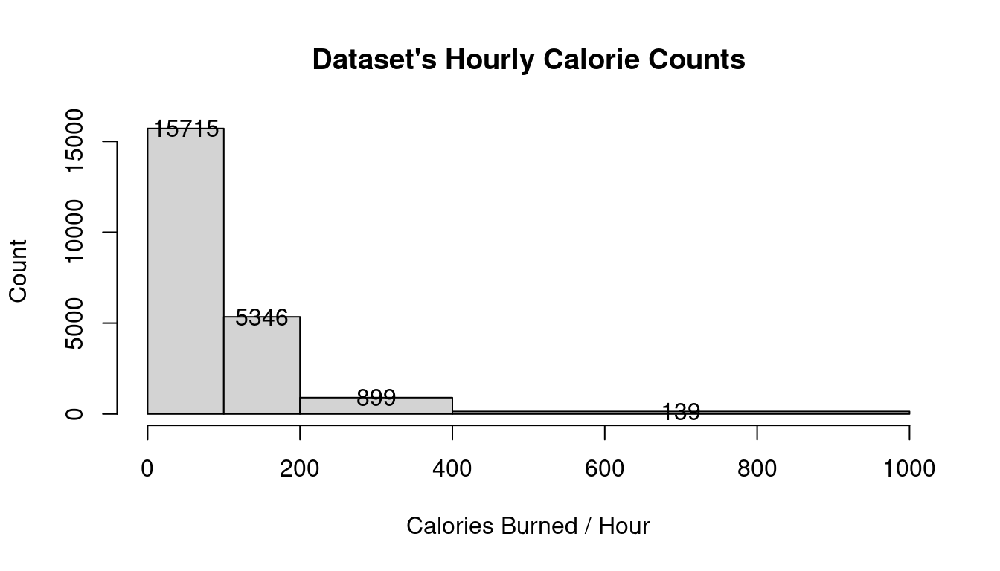

    * Consider categorizing Calories Burned per Hour into 4 levels: {0: Sedentary, 1: LightlyActive, 2: FairlyActive, 3: VeryActive}
    * After summarizing participants from dailyActivities, select a couple from each intensity level and consider plotting weekly/monthly calorie progression, possible pattern might be inciteful. Maybe create workout track for different life/work/school/parent schedules, short high intensity workouts or long low intensity work outs - personalization will likely be marketing point.

* **hourlySteps, hourlyIntensities**:
    * Consider redundant with hourlyCalories, _drop hourlySteps, hourlyIntensities

* **sleepDay**:
```r
        sleepDay %>% group_by(Id) %>% count(Id, sort = TRUE) %>% print(n = 24)
    
        ## # A tibble: 24 × 2
        ## # Groups:   Id [24]
        ##            Id     n
        ##         <dbl> <int>
        ##  1 8378563200    32
        ##  2 5553957443    31
        ##  3 6962181067    31
        ##  4 2026352035    28
        ##  5 3977333714    28
        ##  6 4445114986    28
        ##  7 4702921684    28
        ##  8 4319703577    26
        ##  9 5577150313    26
        ## 10 1503960366    25
        ## 11 4388161847    24
        ## 12 7086361926    24
        ## 13 6117666160    18
        ## 14 2347167796    15
        ## 15 8792009665    15
        ## 16 4020332650     8
        ## 17 1927972279     5
        ## 18 4558609924     5
        ## 19 1644430081     4
        ## 20 1844505072     3
        ## 21 6775888955     3
        ## 22 8053475328     3
        ## 23 7007744171     2
        ## 24 2320127002     1
    
    * 24 distinct users, 413 observations _possibly encourage users to use functionality_
    * Consider dropping users with less than 15 observations
    * Match sleep correlation with daily/weekly workout, likely marketing point. (correlate day of or day after workout?)
```
* **weightLogInfo**:
```r 
        weightLogInfo %>%
          group_by(Id) %>%
          count(Id)
    
        ## # A tibble: 8 × 2
        ## # Groups:   Id [8]
        ##           Id     n
        ##        <dbl> <int>
        ## 1 1503960366     2
        ## 2 1927972279     1
        ## 3 2873212765     2
        ## 4 4319703577     2
        ## 5 4558609924     5
        ## 6 5577150313     1
        ## 7 6962181067    30
        ## 8 8877689391    24
    
    * 8 distinct users, 67 total observations, only 2 users consistently tracked weight.
    * _Drop weightLogInfo due to limited number of users and observations, possibly encourage users to use functionality._
```
Prior to dropping .csv and columns will create a dataframe of feature usage by % user participation and by % observations completed (100% is 33 users over 31 days).
```r
    monthSec <- 33*31*24*60*60
    monthDay <- 33*31
    
    heartrateData <- read.csv(here(data_dir,"heartrate_seconds_merged.csv"))
    
    pie_data <- data.frame(
      metric = c("Weight",
                 " Heartrate",
                 " Sleep   ",
                 "Calories",
                 "Distance",
                 " Steps"
                 ),
    
      pctUsers = round(1/33 * 100 * c(
                    n_distinct(weightLogInfo$Id),
                    n_distinct(heartrateData$Id),
                    n_distinct(sleepDay$Id),
                    n_distinct(dailyCalories$Id),
                    n_distinct(dailyActivity$Id),
                    n_distinct(dailySteps$Id)
                    ), 0),
    
      pctObs = round(100 * c(
                    nrow(weightLogInfo)/ monthDay,
                    nrow(heartrateData)/monthSec,
                    nrow(sleepDay)/monthDay,
                    (nrow(dailyCalories)-4)/monthDay, # 4 Daily Calories of Zero
                    nrow(dailyActivity)/monthDay,
                    (nrow(dailySteps)-78)/ monthDay # 78 Daily Steps of Zero
                    ), 0)
      )

    # Dropping unwanted datasets/columns:
    dailyActivity <- select(
      dailyActivity, -TrackerDistance,
      -LoggedActivitiesDistance, -SedentaryActiveDistance
    ) %>%
      filter(Calories != 0)
    
    rm(dailyCalories, dailyIntensities, dailySteps)
    rm(hourlyIntensities, hourlySteps, weightLogInfo)
```
* * *

## Process:

Will process data for easier analysis and visualization by combining datasets, renaming/removing columns.

Some users in sleepDay have less than 15 observations and will be dropped.
```r
    # sleepDay: Dropping users with less than 15 observations
    dropId <- sleepDay %>%
      select(Id) %>%
      group_by(Id) %>%
      count(Id) %>%
      filter(n < 15)
    
    dropId$Id

    ## [1] 1644430081 1844505072 1927972279 2320127002 4020332650 4558609924 6775888955
    ## [8] 7007744171 8053475328

    sleepDay <- filter(sleepDay, !(Id %in% dropId$Id))
```
Nine users were dropped from sleepDay with a total of 24 users with a minimum of 15 days of observations.

User(s) with less than 15 observations in dailyActivity will be dropped.
```r
    # dailyActivity: Dropping users with less than 15 days of observations
    dropId <- dailyActivity %>%
      select(Id) %>%
      group_by(Id) %>%
      count(Id) %>%
      filter(n < 15)
    
    dropId$Id

    ## [1] 4057192912

    dailyActivity <- filter(dailyActivity, !(Id %in% dropId$Id))
```
Only one user was dropped from dailyActivity with 32 users with a minimum of 18 days of observations.

Categorize TotalMinutesAsleep and Calories, create RestlessBedTime, merge datasets, and drop TotalSleepRecords and TotalTimeInBed.
```r
    # Create dailyMerged from sleepDay + dailyActivity
    # Separate sleepDay$SleepDay into ActivityDate and SleepTime(discard),
    # create RestlessBedTime, categorize TotalMinutesAsleep
    # drop TotalSleepRecords, TotalTimeInBed
    
    sleepDay <- sleepDay %>%
      mutate(RestlessBedTime = TotalTimeInBed - TotalMinutesAsleep) %>%
      separate(SleepDay, c("ActivityDate", NULL), " ") %>%
      select(-TotalSleepRecords, -TotalTimeInBed)
    
    
    sleepDay <- sleepDay %>% mutate(SleepCat = factor(case_when(
      TotalMinutesAsleep / 60 < 6 ~ "Under 6 hours",
      TotalMinutesAsleep / 60 < 8 ~ "6-8 hours",
      TotalMinutesAsleep / 60 > 8 ~ "Over 8 hours"
    ),
    levels = c("Under 6 hours", "6-8 hours", "Over 8 hours"),
    ordered = TRUE
    ))
    
    dailyMerged <- left_join(dailyActivity, sleepDay, by = c("Id", "ActivityDate")) %>% mutate(ActivityDate = mdy(ActivityDate))
    
    # Categorize hourlyCalories and lubridate ActivityHour
    hourlyCalories <- hourlyCalories %>%
      mutate(ActivityHour = mdy_hms(ActivityHour)) %>%
      mutate(weekday = factor(wday(ActivityHour, label = TRUE))) %>%
      mutate(week = factor(case_when(
        ActivityHour < "2016-04-19" ~ 1, # week 1
        ActivityHour < "2016-04-26" ~ 2, # week 2
        ActivityHour < "2016-05-03" ~ 3, # week 3
        ActivityHour < "2016-05-10" ~ 4, # week 4
        ActivityHour >= "2016-05-10" ~ 5
      ), # week 5
      ordered = TRUE
      )) %>%
      mutate(CalorieCat = factor(case_when(
        Calories < 100 ~ "< 100",
        Calories < 200 ~ "100-200",
        Calories < 400 ~ "200-400",
        Calories > 399 ~ "400+"
      ),
      levels = c("< 100", "100-200", "200-400", "400+"),
      ordered = TRUE
      ))
    
    # drop Users with less than 1 week of tracking data
    dropId <- hourlyCalories %>%
      select(Id) %>%
      group_by(Id) %>%
      count(Id) %>%
      filter(n < 24 * 7)
    
    dropId$Id

    ## [1] 4057192912

    hourlyCalories <- filter(hourlyCalories, !(Id %in% dropId$Id))
```
Create a correlation heatmap of merged dataset variables to highlight interesting correlations and find potential redundant variables.
```r
    # ==== Create heatmap of dailyMerged, see what data is correlated
    # [source](http://www.sthda.com/english/wiki/ggplot2-quick-correlation-matrix-heatmap-r-software-and-data-visualization)
    
    cor_dataMerged <- dailyMerged %>%
      select(-Id, -ActivityDate, -SleepCat) %>%
      drop_na() %>%
      cor() %>%
      round(2)
    
    cor_dataMerged[upper.tri(cor_dataMerged)] <- NA
    cor_dataMerged <- melt(cor_dataMerged, na.rm = TRUE)
    
    ggplot(cor_dataMerged, aes(x = Var1, y = Var2, fill = value)) +
      geom_tile(color = "white") +
      theme(axis.text.x = element_text(angle = 45, hjust = 1)) +
      coord_fixed() +
      scale_fill_gradient2(
        low = "red", high = "blue", mid = "white",
        midpoint = 0, limit = c(-0.55, 1), name = "Correlation"
      ) +
      labs(title = "Variable Correlations") +
      theme(
        axis.title.x = element_blank(), axis.title.y = element_blank(),
        plot.title = element_text(hjust = 0.5),
        panel.grid.major = element_blank(), panel.border = element_blank(),
        panel.background = element_blank(), axis.ticks = element_blank(),
        legend.justification = c(1, 0), legend.position = c(0.6, 0.7),
        legend.direction = "horizontal"
      ) +
      guides(fill = guide_colorbar(
        barwidth = 7, barheight = 1,
        title.position = "top", title.hjust = 0.5
      ))
```
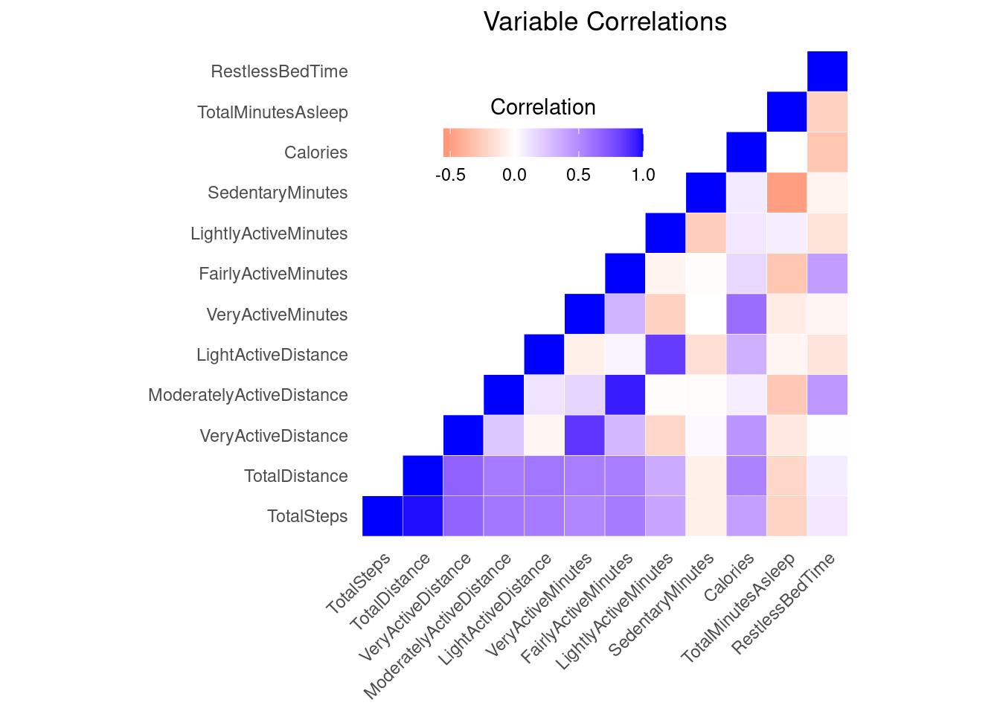

Some variables pairs are highly correlated ( >= 0.85) and will be removed to produce a simplified heatmap:

* TotalSteps, _drop TotalDistance_,
    
* VeryActiveMinutes, _drop VeryActiveDistance_,
    
* LightlyActiveMinutes, _drop LightActiveDistance_,
    
* FairlyActiveMinutes, _drop ModeratelyActiveDistance_,
    
```r
    dailyMerged <- dailyMerged %>%
      select(
        -TotalDistance, -ModeratelyActiveDistance,
        -VeryActiveDistance, -LightActiveDistance
      )
    dailyActivity <- dailyActivity %>%
      select(
        -TotalDistance, -ModeratelyActiveDistance,
        -VeryActiveDistance, -LightActiveDistance
      )
```
* * *

## Analyze:

Will begin by reviewing variable correlations of merged datasets via the simplified heatmap.
```r
    # ==== Re-Create heatmap using simplified dailyMerged
    cor_dataMerged <- dailyMerged %>%
      select(-Id, -ActivityDate, -SleepCat) %>%
      drop_na() %>%
      cor() %>%
      round(2)
    
    cor_dataMerged[upper.tri(cor_dataMerged)] <- NA
    cor_dataMerged <- melt(cor_dataMerged, na.rm = TRUE)
    
    ggplot(cor_dataMerged, aes(x = Var1, y = Var2, fill = value)) +
      geom_tile(color = "white") +
      theme(axis.text.x = element_text(angle = 45, hjust = 1)) +
      coord_fixed() +
      scale_fill_gradient2(
        low = "red", high = "blue", mid = "white",
        midpoint = 0, limit = c(-0.55, 1), name = "Correlation"
      ) +
      labs(title = "Simplified Variable Correlations") +
      geom_text(aes(Var1, Var2, label = value), color = "black", size = 3) +
      theme(
        axis.title.x = element_blank(), axis.title.y = element_blank(),
        panel.grid.major = element_blank(), panel.border = element_blank(),
        panel.background = element_blank(), axis.ticks = element_blank(),
        legend.justification = c(1, 0), legend.position = c(0.6, 0.7),
        legend.direction = "horizontal"
      ) +
      guides(fill = guide_colorbar(
        barwidth = 7, barheight = 1,
        title.position = "top", title.hjust = 0.5
      ))
```
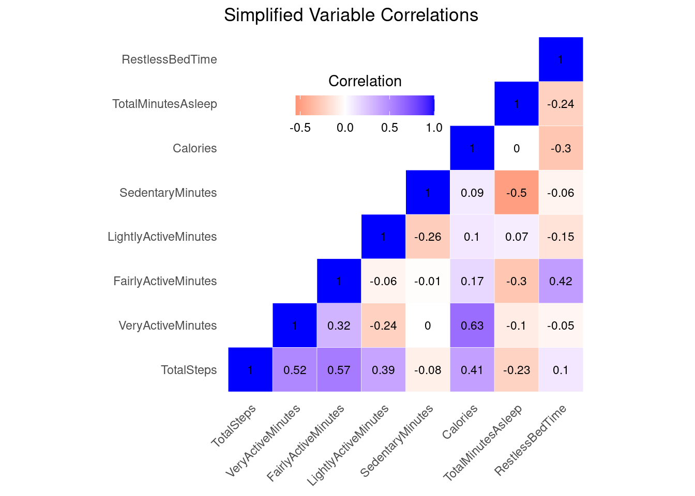

### Interesting Correlation Observations:

* **RestlessBedTime** is reduced with increases in calories burned (-0.30), LightlyActiveMinutes (-0.15) and VeryActiveMinutes(-0.05), oddly increased FairlyActiveMinutes (0.42) increased RestlessBedTime
* **TotalMinutesAlseep** is reduced by increases in FairlyActiveMinutes (-0.30) and TotalSteps(-0.23)
* **SedentaryMinutes** is reduced most by increases in LightlyActiveMinutes (-0.26) and TotalMinutesAlseep (-0.50)
* **Calories** burned increases with degree of activity, VeryActiveMinutes (0.63) > FairlyActiveMinutes (0.17) > LightlyActiveMinutes ( 0.1) which might be explained by impact of minute by minute workout, meaning less intense workouts being longer but with lower calorie burn per minute would numerically correlate with lower values on the heatmap.

### User Overview and Comparisons of 32 Users

The next set of boxplots give an overview of user metrics in Daily Sleep Hours, Restless Bed Time, Daily Calories Burned, and Daily Steps. Users are designated Letters A-Z and Numbers 1 - 6. Missing user boxplots are from NA observations (either non-existant or dropped).
```r
    # boxplot of TotalMinutesAsleep per User Id
    ggplot(dailyMerged, aes(factor(Id), TotalMinutesAsleep / 60,
      fill = factor(Id), alpha = 0.1
    )) +
      geom_boxplot(width = .6, show.legend = FALSE) +
      labs(x = "User", y = "Daily Sleep Hours") +
      geom_jitter(width = 0.15, show.legend = FALSE, size = 1) +
      scale_y_continuous(
        breaks = c(1.5, 3, 4.5, 6, 7.5, 9, 10.5, 12),
        expand = c(0, 0)
      ) +
      scale_x_discrete(labels = c(LETTERS, 1:6))
    
    # boxplot of RestLessBedTime per User Id
    ggplot(dailyMerged, aes(factor(Id), RestlessBedTime,
      fill = factor(Id), alpha = 0.1
    )) +
      geom_boxplot(width = .6, show.legend = FALSE) +
      labs(x = "User", y = "Restless Bed Time (minutes)") +
      geom_jitter(width = 0.15, show.legend = FALSE, size = 1) +
      scale_y_continuous(expand = c(0, 0)) +
      scale_x_discrete(labels = c(LETTERS, 1:6))
    
    # boxplot of Calories per User Id
    ggplot(dailyMerged, aes(factor(Id), Calories,
      fill = factor(Id), alpha = 0.1
    )) +
      geom_boxplot(width = .6, show.legend = FALSE) +
      labs(x = "User", y = "Daily Calories Burned") +
      geom_jitter(width = 0.15, show.legend = FALSE, size = 1) +
      scale_y_continuous(expand = c(0, 0)) +
      scale_x_discrete(labels = c(LETTERS, 1:6))
    
    # boxplot of Steps per User Id
    ggplot(dailyMerged, aes(factor(Id), TotalSteps,
      fill = factor(Id), alpha = 0.1
    )) +
      geom_boxplot(width = .6, show.legend = FALSE) +
      coord_cartesian(ylim = c(0, 30000)) +
      labs(x = "User", y = "Daily Steps") +
      geom_jitter(width = 0.15, show.legend = FALSE, size = 1) +
      scale_y_continuous(expand = c(0, 0)) +
      scale_x_discrete(labels = c(LETTERS, 1:6))
```
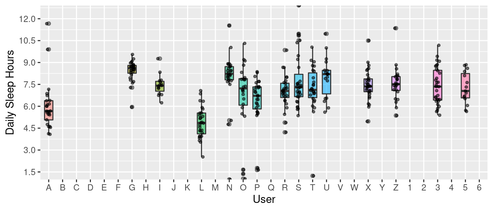
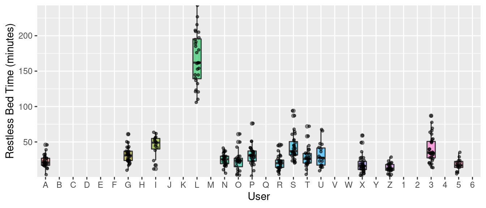
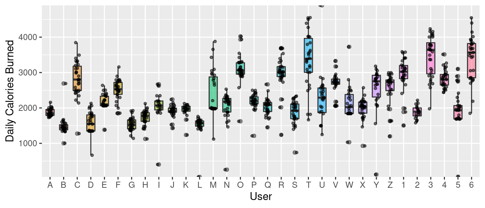
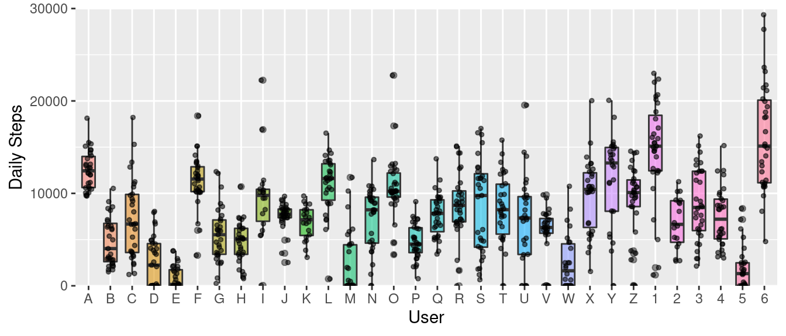

Daily Sleep Hours Plot shows 15 users averaging about 7.1 hours of sleep. Restless Bed Time was pretty consistent with an average of 38 minutes, with one user (User L) as an outlier averaging 168 minutes, which coincidentally paired with the lowest average Daily Sleep Hours of 4.9 hours.

The plots of Daily Calories Burned and Daily Steps do somewhat follow a similar pattern as was indicated in the correlation heatmap with a value of 0.41. Number of steps varied quite a bit with a daily average and standard deviataily SLeepion of : 7701, 5075. Ultimately, these plots were added for practice and the extra color they bring to the document.
```r
# Overloaded barchart of User Activity Minutes and Calories Burned
meltdailyMerged <- dailyMerged %>%
  select(
    Id, VeryActiveMinutes,
    FairlyActiveMinutes,
    LightlyActiveMinutes,
    SedentaryMinutes, Calories
  ) %>%
  melt(id.vars = "Id") %>%
  drop_na() %>%
  group_by(Id, variable) %>%
  summarise_all(mean)

meltdailyMerged %>%
  filter(!(variable %in% c("Calories", "SedentaryMinutes"))) %>%
  ggplot(aes(x = factor(Id), y = value, fill = variable)) +
  geom_bar(position = "stack", stat = "identity", color = "black") +
  labs(
    x = "User", title = "Daily Average Activity Minutes",
    subtitle = "Daily Average Calories Burned"
  ) +
  scale_x_discrete(labels = c(LETTERS, 1:6)) +
  geom_point(meltdailyMerged %>% filter(variable == "Calories"),
    mapping = aes(x = factor(Id), y = value * 0.25),
    size = 2, color = "blue"
  ) +
  scale_y_continuous(
    name = "Very/Fairly/Lightly - Activity Minutes",
    sec.axis = sec_axis(~ . / 0.25, name = "Calories Burned"),
    expand = c(0, 0)
  ) +
  theme(
    axis.title.y.right = element_text(color = "blue"),
    axis.text.y.right = element_text(color = "blue"),
    plot.subtitle = element_text(color = "blue"),
    panel.grid.major.x = element_line(color = "black", size = 0.1)
  )
```
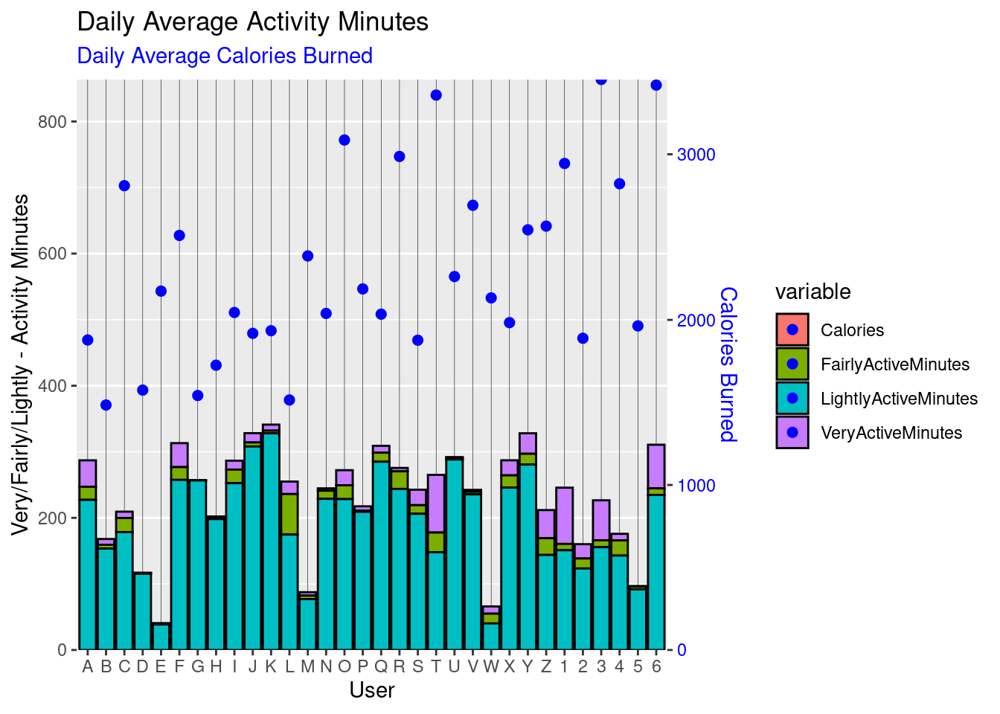

This combined plot of Average Activity Minutes and Calories Burned is mostly an exercise in presenting two datasets within a single plot using a second axis. The collective Activity Minutes (not including Sedentary Activity Minutes) do seem to follow a similar trend to the values of Calories Burned.

The goal of the next few time series heatmaps is to facilitate grouping of Users by activity schedules (Calories Burned) by day and hour.
```r
    ggplot(dailyMerged, aes(x = ActivityDate, y = factor(Id), fill = Calories)) +
      geom_tile() +
      scale_fill_gradient2(low = "white", high = "red", mid = "blue", name = "Calories", midpoint = 2000, limit = c(0, max(dailyMerged$Calories))) +
      theme(
        axis.text.x = element_text(angle = 90),
        plot.title = element_text(hjust = 0.5)
      ) +
      scale_x_continuous(
        breaks = unique(dailyMerged$ActivityDate)[seq(1, 31, 7)],
        expand = c(0, 0),
        limits = c(NA, dailyMerged$ActivityDate[30])
      ) +
      scale_y_discrete(labels = c(LETTERS, 1:6)) +
      labs(y = "Users", title = "Daily Calories Burned")
```
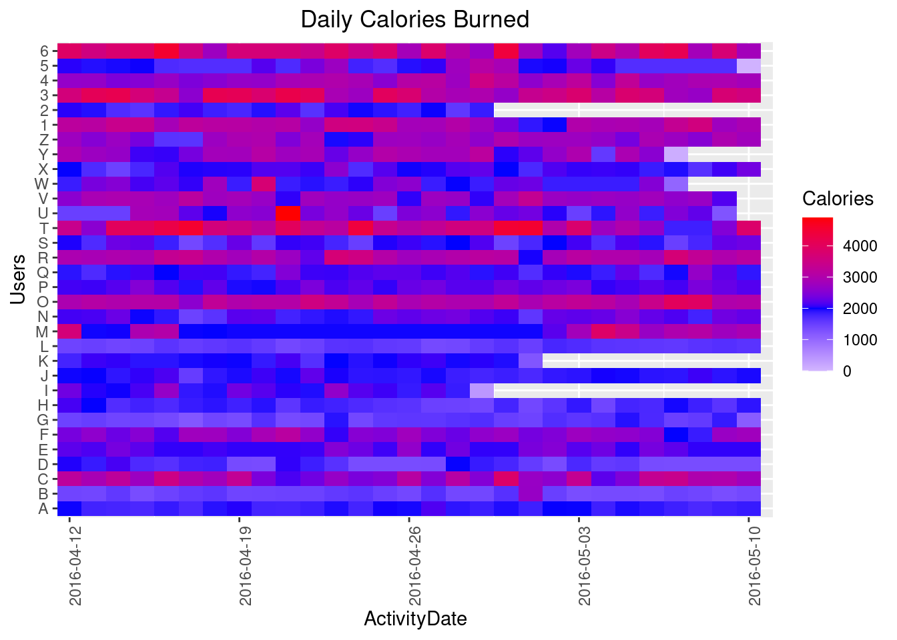
```r
    dailyMerged <- dailyMerged %>%
      mutate(Id = factor(Id)) %>%
      mutate(week = factor(case_when(
        ActivityDate < "2016-04-19" ~ 1, # week 1
        ActivityDate < "2016-04-26" ~ 2, # week 2
        ActivityDate < "2016-05-03" ~ 3, # week 3
        ActivityDate < "2016-05-10" ~ 4, # week 4
        ActivityDate >= "2016-05-10" ~ 5
      ), # week 5
      ordered = TRUE
      ))
    
    
    plotLabels <- c(LETTERS, 1:6)
    names(plotLabels) <- unique(dailyMerged$Id)
    
    dailyMerged %>%
      filter(week != 5) %>%
      ggplot(aes(
        x = wday(ActivityDate, label = TRUE), y = week,
        fill = Calories
      )) +
      facet_wrap(~Id, nrow = 8, labeller = labeller(Id = plotLabels)) +
      geom_tile() +
      theme(
        axis.text.x = element_text(angle = 90),
        plot.title = element_text(hjust = 0.5)
      ) +
      theme(strip.background = element_rect(fill = "white")) +
      theme(strip.text = element_text(colour = "black")) +
      labs(x = "Weekday", title = "User Daily Calories Burned (4 Weeks)") +
      scale_fill_gradient2(
        low = "white", high = "red", mid = "blue",
        name = "Calories", midpoint = 2000,
        limit = c(0, max(dailyMerged$Calories))
      )
```
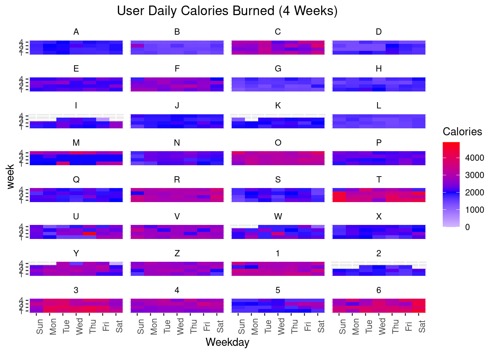

From the previous two plots, a few different pattern in users can be discerned. There are users with consistent daily calories burned and minimal spikes (Users: L, O, R), there are users with noticeable workout/burn patterns, some relax on weekends, others work out weekends or Wednesdays (Users: A, C, D, F, N, Q, T, X, 3, 6), and some users with more sporadic daily calories burned (Users: B, E, G-K, M, P, S-Z, 1, 2, 4, 5).
```r
    hourlyCalories <- hourlyCalories %>% mutate(ActivityTime = hour(ActivityHour), ActivityDate = date(ActivityHour))
    
    hourlyCalories %>%
      filter(week != 5) %>%
      ggplot(hourlyCalories, mapping = aes(weekday, ActivityTime,
        fill = CalorieCat
      )) +
      geom_tile(color = "white", size = 0.1) +
      facet_grid(Id ~ week, labeller = labeller(
        Id = plotLabels,
        week = label_both
      )) +
      theme(
        axis.text.x = element_text(angle = 45, hjust = 1),
        plot.title = element_text(hjust = 0.5)
      ) +
      labs(
        title = "Weekly Calories Burned by Hour", x = "Day of Week",
        y = "Time of Day (24 HOUR)"
      ) +
      scale_y_continuous(trans = "reverse") +
      theme(legend.position = "top") +
      theme(strip.background = element_blank())
```
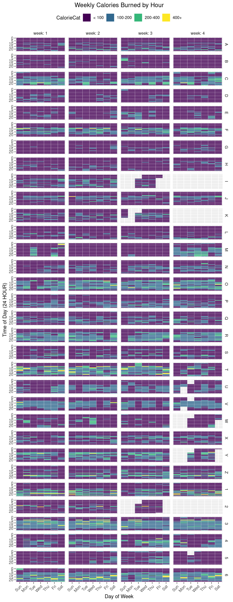

From the weekly time series heatmaps, a few observations are:

* More users had tracking the first two weeks, then second two weeks
* Consistency in calorie burning schedules is likely around work or school schedule:
    * More users were active (100+ calories/hour) after 5pm
    * Morning, Midday, Afternoon peaks that might correspond to movement to/from/around work
    * Active weekend users or users with Tuesday/Thursday/Saturday workouts
    * Less active users seem to have more erratic calorie burn schedules
```r
    dailyMerged %>%
      select(Id, TotalMinutesAsleep, ActivityDate) %>%
      mutate(weekday = wday(ActivityDate, label = TRUE)) %>%
      ggplot() +
      geom_violin(aes(x=weekday, (y = TotalMinutesAsleep / 60))) +
     theme(
        panel.grid.major.x = element_blank(), panel.grid.minor.x = element_blank(),
        plot.title = element_text(hjust = 0.5)
      ) +
      scale_y_continuous(breaks = c(3, 4.5, 6, 7.5, 9, 10.5, 12)) +
      scale_x_discrete() +
      labs(y = "Hours of Sleep", title = "Daily Sleep Hours", x = "Weekday")
```
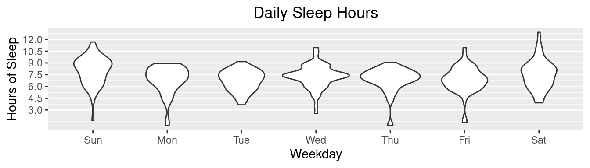

On average users sleep more hours on weekends then weekdays, and also have a bit more variability in hours slept on weekends as well.

### Clustering (for fun and learning)

Lastly, a summary of user values will be analyzed using Kmeans and PCA to see how to group users and to see which are the most differentiating variables. It seems sleeptime data has a lot of NAs, so will review and see how best to handle.
```r
    # Review number of NAs in sleep time data
    dailyMerged %>%
      select(Id, TotalMinutesAsleep, RestlessBedTime) %>%
      group_by(Id) %>%
      summarise(missingSleep = sum(is.na(TotalMinutesAsleep)), missingBedTime = sum(is.na(RestlessBedTime))) %>%
      arrange(desc(.[, 2])) %>% print(n=40)

    ## # A tibble: 32 × 3
    ##    Id         missingSleep missingBedTime
    ##    <fct>             <int>          <int>
    ##  1 1624580081           31             31
    ##  2 1844505072           31             31
    ##  3 1927972279           31             31
    ##  4 2022484408           31             31
    ##  5 2320127002           31             31
    ##  6 2873212765           31             31
    ##  7 4020332650           31             31
    ##  8 4558609924           31             31
    ##  9 8053475328           31             31
    ## 10 8877689391           31             31
    ## 11 1644430081           30             30
    ## 12 8583815059           30             30
    ## 13 6290855005           28             28
    ## 14 6775888955           26             26
    ## 15 7007744171           26             26
    ## 16 3372868164           20             20
    ## 17 8253242879           18             18
    ## 18 8792009665           14             14
    ## 19 6117666160           10             10
    ## 20 4388161847            8              8
    ## 21 7086361926            7              7
    ## 22 1503960366            5              5
    ## 23 4319703577            5              5
    ## 24 4702921684            4              4
    ## 25 5577150313            4              4
    ## 26 2026352035            3              3
    ## 27 2347167796            3              3
    ## 28 4445114986            3              3
    ## 29 3977333714            2              2
    ## 30 5553957443            0              0
    ## 31 6962181067            0              0
    ## 32 8378563200            0              0
```
Regarding sleep time data, only 3 users have complete sets, about a third of users have less than 10 days missing, and about half are missing 20 or more days. There is an option to impute median/mean values to replace NAs, but will instead exclude TotalMinutesAlseep and RestlessBedTime for Kmeans/PCA. Potential option is to perform MFA that can handle NAs without dropping data and be able to classify users based on weekly schedules.

The first plot below helps determines an optimal number of Kmeans groups for users.
```r
    # Create a summary dataframe for Kmeans
    
    summaryMerged <- dailyMerged %>%
      select(-ActivityDate, -SleepCat, -week) %>%
      group_by(Id) %>%
      summarize(across(
        .cols = everything(),
        .fns = mean, na.rm = TRUE
      )) %>%
      column_to_rownames("Id")
    
    summaryMerged2 <- summaryMerged
```
Before continuing with Kmeans/PCA, the data will be cleaned of NAs.
```r
    # replace NAs in TotalMinutesAsleep and RestlessBedTime with mean
    # since Kmeans/PCA methods don't handle NAs
    summaryMerged <- summaryMerged[c(1:6)]
    # summaryMerged[is.na(summaryMerged[7]),7] <- mean(summaryMerged[,7], na.rm = TRUE)
    # summaryMerged[is.na(summaryMerged[8]),8] <- mean(summaryMerged[,8], na.rm = TRUE)
    
    summaryMerged <- as.data.frame(scale(summaryMerged))
    
    # find good number of clusters
    fviz_nbclust(summaryMerged, kmeans, method = "wss")
```
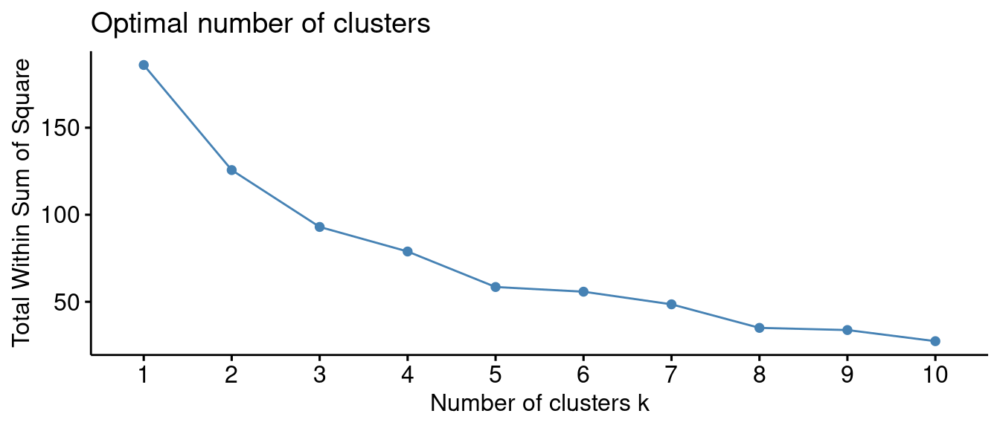

 The data collected in TotalMinutesAsleep and RestlessBedTime has many NAs and will be excluded from Kmeans/PCAa analysis.

An optimal number of clusters is around the elbow point, but the plot seems to flow smoothly, so a value of 3 or 4 seems reasonable, I will use 4 clusters.
```r
    km <- kmeans(summaryMerged, centers = 4, nstart = 25)
    km$size # view population of each cluster

    ## [1]  8  9  4 11

    fviz_cluster(km, data = summaryMerged)
```
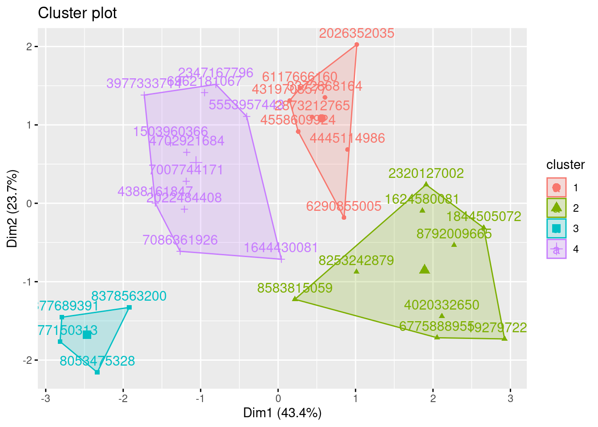

The four clusters have: 8, 9, 4, 11 users with within cluster sum of squares 61%. A summary of each cluster’s average metric values is presented in table below.
```r
    options(digits = 1)
    # create table with mean values for each cluster
    summaryTable <- aggregate(summaryMerged2, by = list(cluster = km$cluster), mean, na.rm = TRUE)
    summaryTable <- cbind(summaryTable, NumberUsers = km$size)
    
    colnames(summaryTable) <- gsub("^([A-Z].*)+([A-Z]+\\w+)", "\\1\n\\2", colnames(summaryTable))
    
    formattable(summaryTable, align = "c",
                list(
                formattable::area(col = 2) ~ color_tile("white", "aquamarine"),
                formattable::area(col = 3) ~ color_tile("white", "magenta"),
                formattable::area(col = 4) ~ color_tile("white", "magenta"),
                formattable::area(col = 6) ~ color_tile("white", "lightblue"),
                formattable::area(col = 7) ~ color_tile("white", "lightcyan")
                ))
```
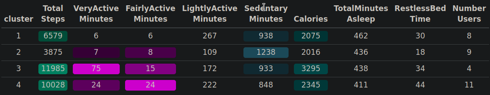

Based on clustering, it seems the most distinguishing metrics are TotalSteps, LightlyActiveMinutes, VeryActiveMinutes, SedentaryMinutes, and Calories.
```r
    final_data <- cbind(summaryMerged2, cluster = factor(km$cluster))
    
    final_data %>% ggplot(aes(x = TotalSteps, y = LightlyActiveMinutes, color = cluster, size = VeryActiveMinutes)) +
      geom_point()
```
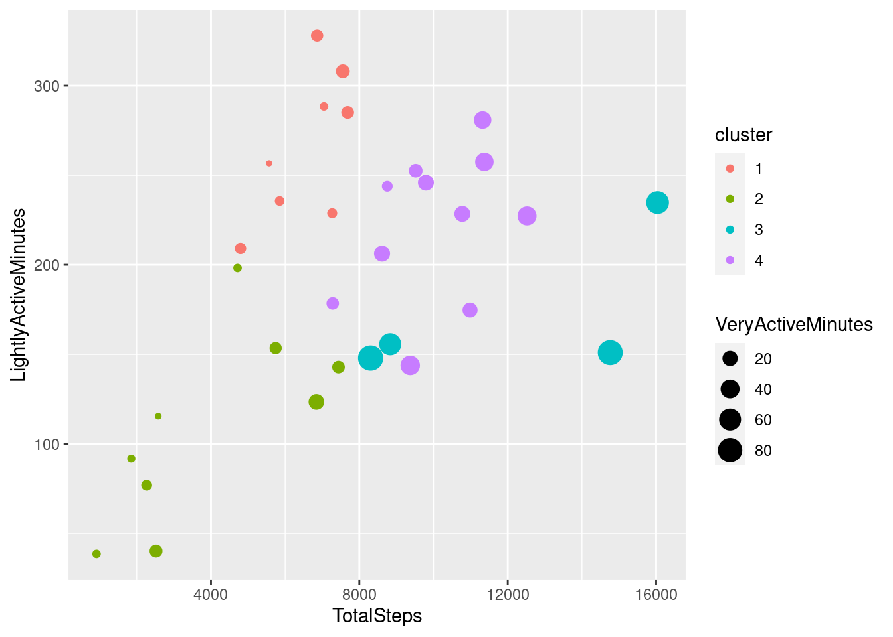

A second analysis will be perfomed using FactoMiner’s PCA function, and will presents user variables in slightly different ways.
```r
    # Source: https://rpkgs.datanovia.com/factoextra/
    
    res.pca <- PCA(summaryMerged, graph = FALSE)
    
    var <- get_pca_var(res.pca) # visualize variables
    
    # Contributions of variables to PCA Dimension 1
    a <- fviz_contrib(res.pca, choice = "var", axes = 1, top = 10)
    
    # Contributions of variables to PCA Dimension 2
    b <- fviz_contrib(res.pca, choice = "var", axes = 2, top = 10)
    
    a + b # plot both Contributions
```
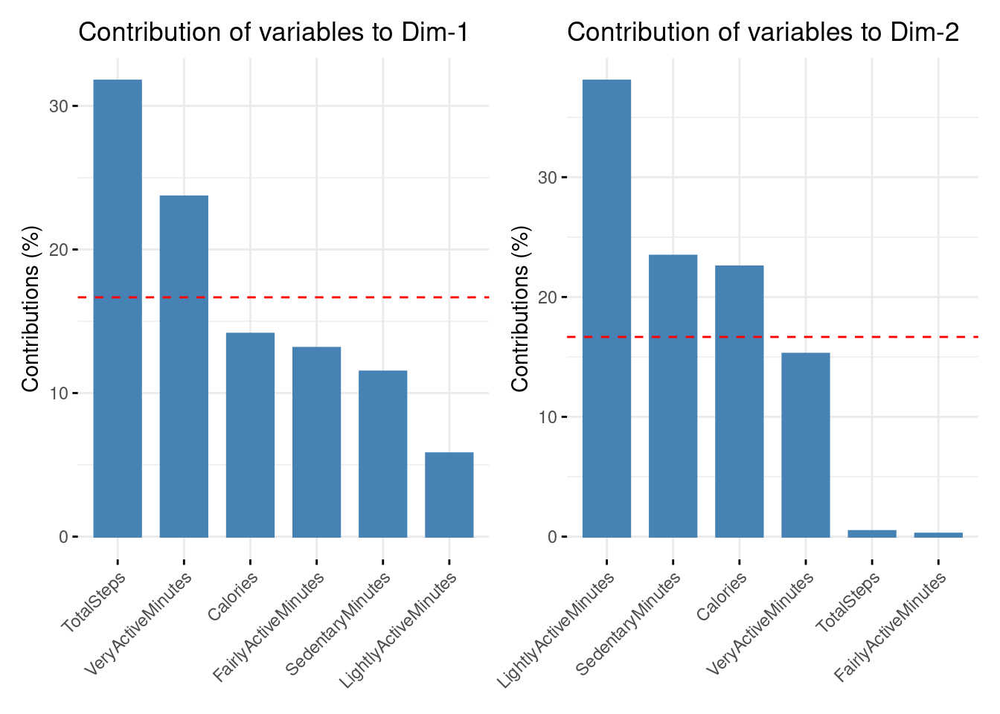
```r
    # Extract the results for individuals
    ind <- get_pca_ind(res.pca)
    
    # Plot of individuals in groups by color and variable contributions
    fviz_pca_biplot(res.pca,
      col.ind = "cos2",
      gradient.cols = c("#00AFBB", "#E7B800", "#FC4E07"),
      repel = TRUE
    )
```
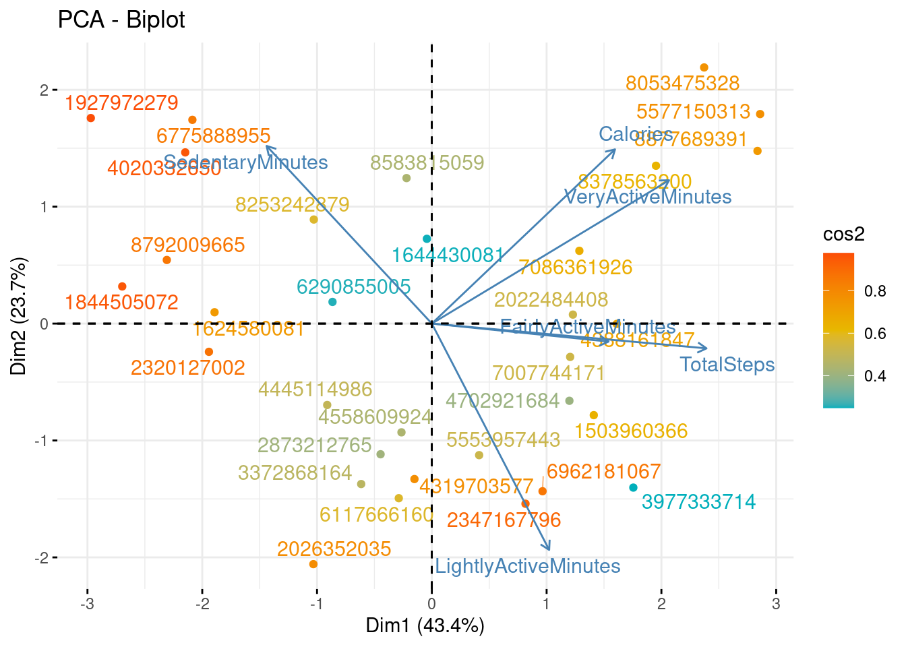

Based on PCA by weight, it seems the most distinguishing metrics are _TotalSteps, VeryActiveMinutes, LightlyActiveMinutes, Calories_, and _Sedentary Minutes_. The last plot shows the grouping of users by color overlayed with the first two PCA dimensions. As might of been expected the users were grouped by activity, falling into activity categories: _Very, Fairly, Lightly,_ and _Sedentary_. A possible good addition would be an analysis of hourlyCalories to categorize by schedule, to determine users as having school/work schedule, post-work workouts, weekend athletes/loungers, etc.

* * *

### Summary of Analysis:

The main tasks for the case study are:

* Analyze consumer product use, and advise how our products can meet user needs (functions used).
* Analyze usage trends, and advice how our marketing/products can match with users (categorieze users).
```r
    pie_label2 <- paste0(as.character(pie_data[,2]), "%")
    pie_label3 <- paste0(as.character(pie_data[,3]), "%")
    
    a <- ggplot(pie_data,
                aes(
                  x = metric,
                  y = pctUsers,
                  fill = factor(metric)
                )) +
      labs(
        title = "Feature Usage",
        subtitle = "by % User"
      ) +
      geom_col(width = 1, color = "white") +
      coord_polar() +
      theme_minimal() +
      theme(
        legend.position = "none",
        axis.title.x = element_blank(),
        axis.title.y = element_blank(),
        axis.ticks = element_blank(),
        axis.text.y = element_blank(),
        axis.text.x = element_text(face = "bold"),
        plot.title = element_text(size = 20, face = "bold"),
        plot.subtitle = element_text(size = 12)
      ) +
      geom_text(aes(x = metric, label = pie_label2), vjust = -1)
    
    b <- ggplot(pie_data,
                aes(
                  x = metric,
                  y = pctObs,
                  fill = factor(metric)
                )) +
      labs(
        subtitle = "by % Observations"
      ) +
      geom_col(width = 1, color = "white") +
        coord_polar() +
        theme_minimal() +
        theme(
          legend.position = "none",
          axis.title.x = element_blank(),
          axis.title.y = element_blank(),
          axis.ticks = element_blank(),
          axis.text.y = element_blank(),
          axis.text.x = element_text(face = "bold"),
          plot.title = element_text(size = 18, face = "bold"),
          plot.subtitle = element_text(size = 12)
        ) +
        geom_text(aes(x = metric, label = pie_label3), hjust = -.5)
    
    a + b
```
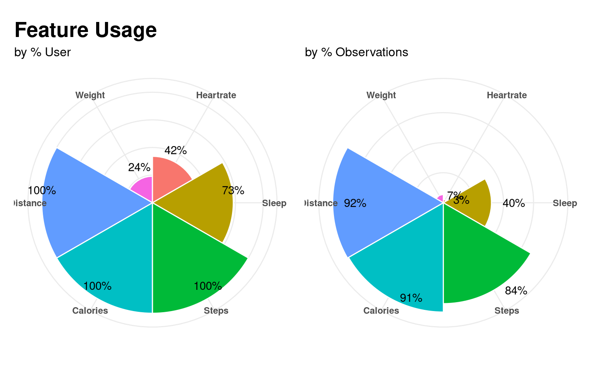

**_Features usage_** included in the dataset is summarized in the pie charts (33 Users at 31 days is 100%):

* **Weight** tracking was the least utilized feature with only two users fully utilizing during the month-long dataset, eight users (24%) total participated with at least one observation. For weight tracking consider factors to promote usage and consider why feature was not used, possibly an unwanted feature or not convenient to use.
* **Heartrate** monitoring was used by 14 users (42%). Considering the feature is passively tracked, users have opted out for some reason (3% observation rate), this reason should be identified, possibly for privacy or for battery life.
* **Sleep** monitoring was used by 24 distinct users (73%) with 15 users using for 15 or more days (40% observation rate). Considering sleep variability of users and number of users, this feature seems underutilized, if not already, consider making opt-in more passive with integration of audio, heartrate, and/or accelerometer monitoring. Reducing restless bed time can be targeted with sleep inducing methods as part of membership.
* **Steps/Calories/Distance** - These 3 features were used by all participants at very high rates, with distance/intensity capturing the most observations at 92% and the lowest being steps observations at 84%. The passive observation collection via pedometer/accelerometer/gps likely lead to high observation rates and should consider applying method to other features to improve value for users.

**_Categorizing Users_** by schedule and fitness activity.

1.  _User calorie_ schedule were presented in monthly/weekly/hourly heatmaps. From these heatmaps users can be categorized by weekly patterns:
    
    * Possible work/school movement: morning, midday, and afternoon
    * After-work workouts, Tue/Thur, weekend athletes/loungers, Wednesdays only
    * Sporadic daily calories burned - more likely lower average calorie users
    * Consistent daily calories burned with minimal day-to-day variation

Consider appropriate activity reminders, or a one-day membership perk to keep activities on track. Consider personalized workout tracks for different life/work/school/parent schedules, short high intensity workouts or long low intensity work outs

2.  _User fitness_ was categorized into four groups using PCA. As the data used for the PCA is fitness data, the results appropriately categorized users fitness as: _Very, Fairly, Lightly_, and _Sedentary_. Based on PCA by weight, the most distinguishing metrics in order are:
    * TotalSteps
    * VeryActiveMinutes
    * LightlyActiveMinutes
    * Calories
    * Sedentary Minutes

Surprisingly for some users, an increase in restless bedtime was correlated with an increase in Fairly Active Minutes (correlation of 0.42).

* * *

## Share & Act: Key Marketing Points

The goal for this case study is to develop marketing insights based on analysis of non-Bellabeat user fitness tracking data.

**_Key takeaways_** to consider:

* Polish popular features - Distance/Calories/Steps - by marketing easier usage, using passive tracking techniques to increase user value.
* Review usage of less popular features - Weight/Heartrate/Sleep for either improvement or to promote usage of.
* Continue targeting user types of all activity levels.
* Consider promoting customized fitness schedules targeting the various user types, i.e. around work/school schedules, at end of weekday when persons generally workout or weekend fitness.
* Depending on future marketing goals, consider a much larger fitness tracking dataset with demographics to aid in marketing guidance.